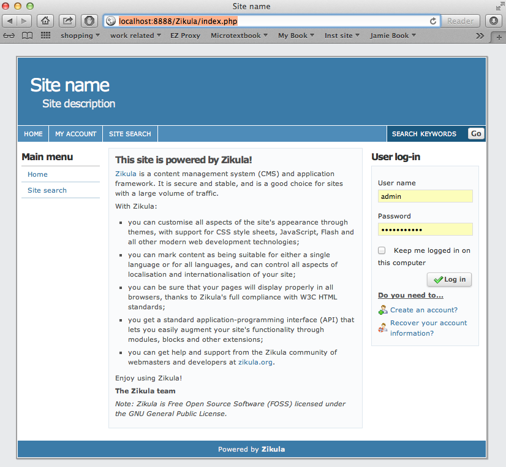
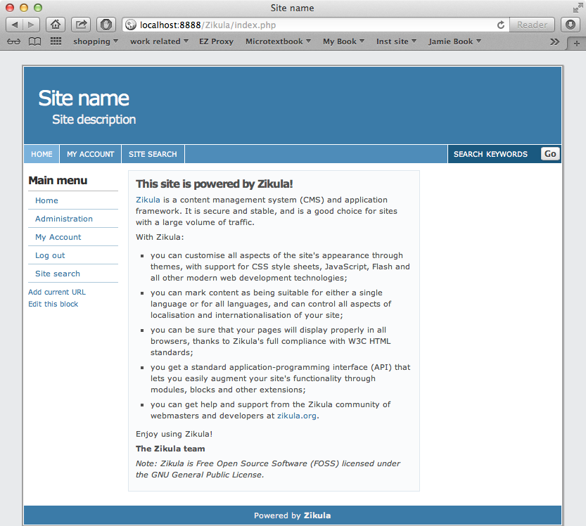
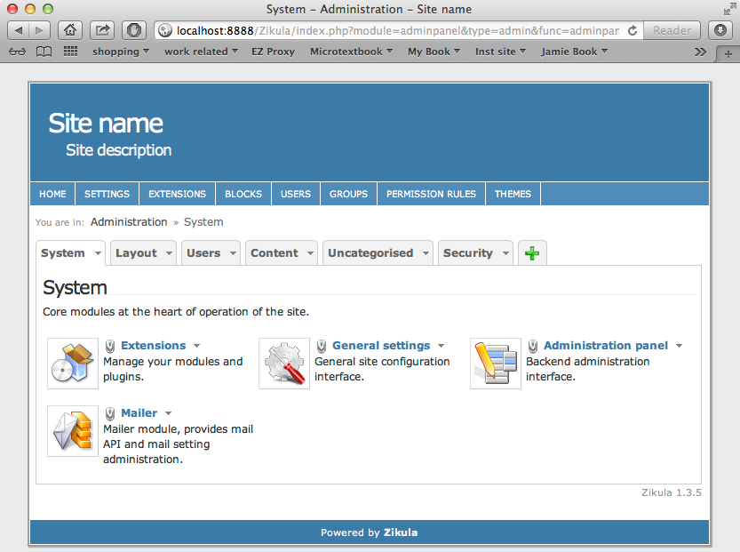
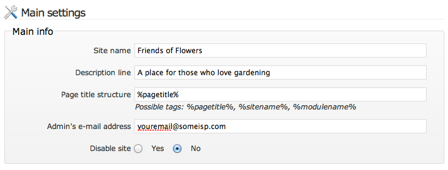
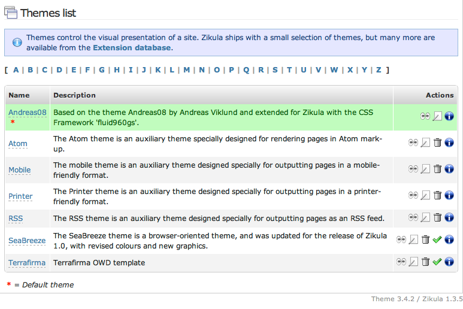
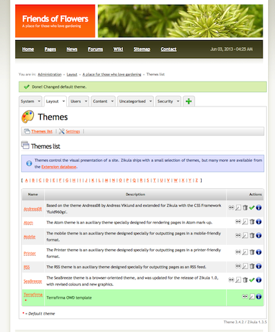

Configuring your Zikula Site
===========================

:Author:
    Timothy Paustian
    
So you have your site installed and up and running, now what? Well first of all I want my site to have a different look. In addition, I want to get rid of that welcome text. How can I do those things? In this section will take you through the basics of beginning the set up of Zikula. In later sections we will get to setting up the modules necessary for adding content to your site.

Quick Guide
-----------

#. Make your site secure by setting the config.php file to read-access by owner only
#. Turn off `magic quotes <http://php.net/manual/en/security.magicquotes.disabling.php>`_
#. Log into your site using your administration username and password.
#. Click on the Administration Link and then the General Setting module link
#. In the Main Info section fill in the Site Name and Site Description
#. Change the meta tags section to match your sites main info. Pay special attention to the meta tags.
#. Find a Theme you like at The Ziklula `gallery site <http://www.zikula-themes.de/index.php?module=ThemeGallery&type=user&func=main&lang=en>`_. Download the `Zikula Theme you like <https://github.com/zikula/themes>`_ on GitHub.
#. Place this theme into your themes folder of your Zikula site.
#. Go to the Administration page, and then click on the Layout tab. Next, click on themes. You will be presented with a list of possible themes and you should see the Terrafirma theme at the bottom of the list.
#. Click on the green checkmark next to the theme of choice to set it as the default theme. You will be asked to confirm your choice. When you do, the entire appearance of the site changes to the new theme.

Security First
--------------

Before you do anything, Zikula may warn you that there are security issues with your site. Make sure that your config file (in config/config.php) has read access for the owner and no access for anyone else. If possible, the install script will do this for you. If this fails, then you need to set these permissions manually. This can often be done using the file manager to your web site. Or if you have command line access, you can issue the following command in a Terminal application while you are in the config directory::

chmod 400 config.php

Also, magic_quotes should be off for your site. If it is turned on, it is possible to turn it off in two ways and the `php manual <http://php.net/manual/en/security.magicquotes.disabling.php>`_ explains how to do it. 

Configuring site basics
-----------------------

Andreas08 is the initial theme that a freshly installed copy of Zikula begins with. A theme is a collection of templates that describe how your site will look. There are dozens of different themes, but for right now Andreas08 is a good theme for getting to know Zikula. When you first set up a site, you have an idea in mind, its going to be a blog for bikers, or be a placed that people interesteed in campers and the outdoors will hang out, or maybe its for people who love gardening. Yes, lets go with that, a site about gardening. This site is going to be named, **Friends of Flowers**, but right now it has the name, Site Name! Let's switch that first. If you go to your home page you will see a Main Menu on the left and a panel to Log in on the right. In the center block will be a welcome comment about using Zikula. Note that your site can already do plenty. You have links to the home page, your account and site search.

    
    After your initial install of Zikula, this is what the home page will look like.

As an initial step we want to change the name of our site to Friends of Flowers and add a description. While we are there we will also want to change some other settings. To do any of this we have to log in. During the intall you choose an admin username and password. Type these into the log in box on the left. After you have done this, your page should look like this.

    
    After you log in, the appearance of the site changes

Note how the Main menu has a number of new options, including an Administration link. Click on this link. When you do you will be taken to the Administration interface. These pages list all the modules that are installed on your site. Each is a collection of code that take care of a specific tasks. Take a minute and click on all the tabs and examine the modules that are part of the core system. We will be getting to many of them as we go through the sites set up. For now, go back to the Systems tab and click on the General settings module.

    
    The Admin layer with the System tab in view.

In the General Settings tab you can now change the name of your site. In the Main Info section fill in the text as show below.

    
    The main information configured for our new flower site

While you are here, you will also want to change the meta tag settings. This is information that search engines crawling your site look for to help them categorize your site. The default page title is often set the same as your site name. The description also will often be set to be the same as what you put in the Main info area. Finally the meta keywords should correspond to your sites focus. For our example it would be Flowers, Gardens, Vegetables, Fertilizer, Mulch, Shovels, Weeding, topiary, etc. It is important to spend some time filling out especially the meta keywords thoughtfully. This will help people looking for your site on search engines. The rest of the settings on this page should be left alone for now. Go to the bottom of the page and click Save. You will notice that the title of your site has now changed. However, this theme really isn't that flowery. We should find a better theme.

Setting the Theme
-----------------

Dozens of Zikula themes have been created and a large collection of them can be found at `zikula/themes <https://github.com/zikula/themes>`_ on GitHub. It would be difficult to pick through all these themes, but a `gallery site <http://www.zikula-themes.de/index.php?module=ThemeGallery&type=user&func=main&lang=en>`_ has been set up where you can browse many of them. Parts of it are in German, but you can still test and download themes from there. If you browse through the themes you will find the Terrafirma has a very nice garden flavor to it, so let's use that one. This can be downloaded from Github, where the most recent themes should be located. Got to `Zikula Themes <https://github.com/zikula/themes/>`_ at GitHub and then click on the Zip button near the top of the page. This will download all the themes and you can grab the Terrafirma theme out of the downloaded and unzipped package. Place the Terrafirma folder in the themes folder of your website. You can play with any of the themes that were downloaded. All of them should work with the latest version of Zikula.

We now want our site to use our new Terrafirma theme. Go to the Administration page, and then click on the Layout tab. Next, click on themes. You will be presented with a list of possible themes and you should see the Terrafirma theme at the bottom of the list.

    
    The appearance of your site can change just be picking a different available theme. All of these themes are located in the themes folder of your Zikula folder.

Click on the green checkmark next to the Terrafirma theme to choose it as the default theme. You will be asked to confirm your choice. When you do, the entire appearance of the site changes to the Terrafirma theme.

    
    The site as seen through the Terrafirma theme.

Click on the Home link and you can see that our site is really starting to take shape. If you click around a bunch you will notice that many of the links don't work. This is because we have not installed the required modules. In a later chapter of the User Manual, we will talk about how to customize a theme. In the next section we will describe how to add Content to your site.

