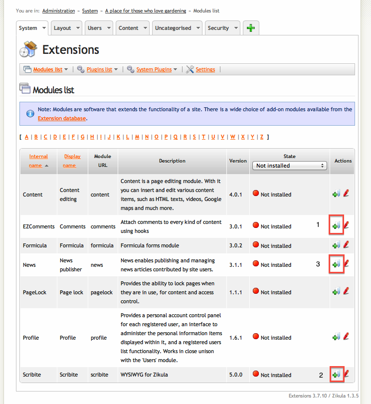
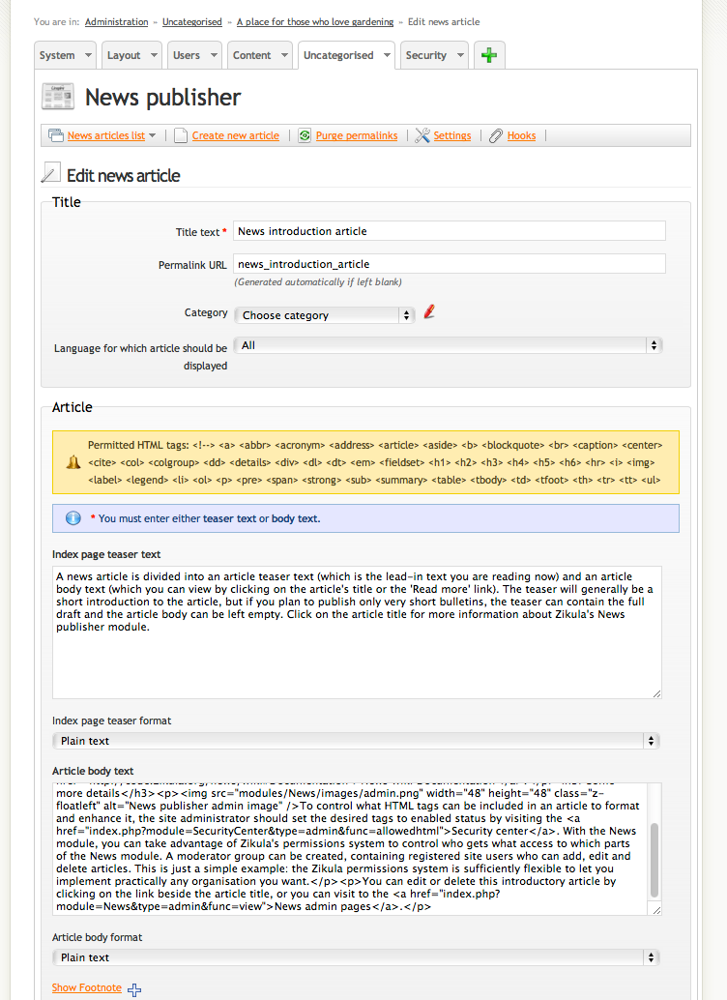
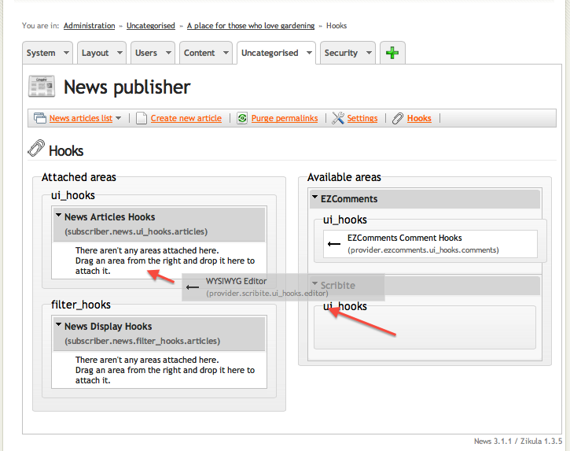
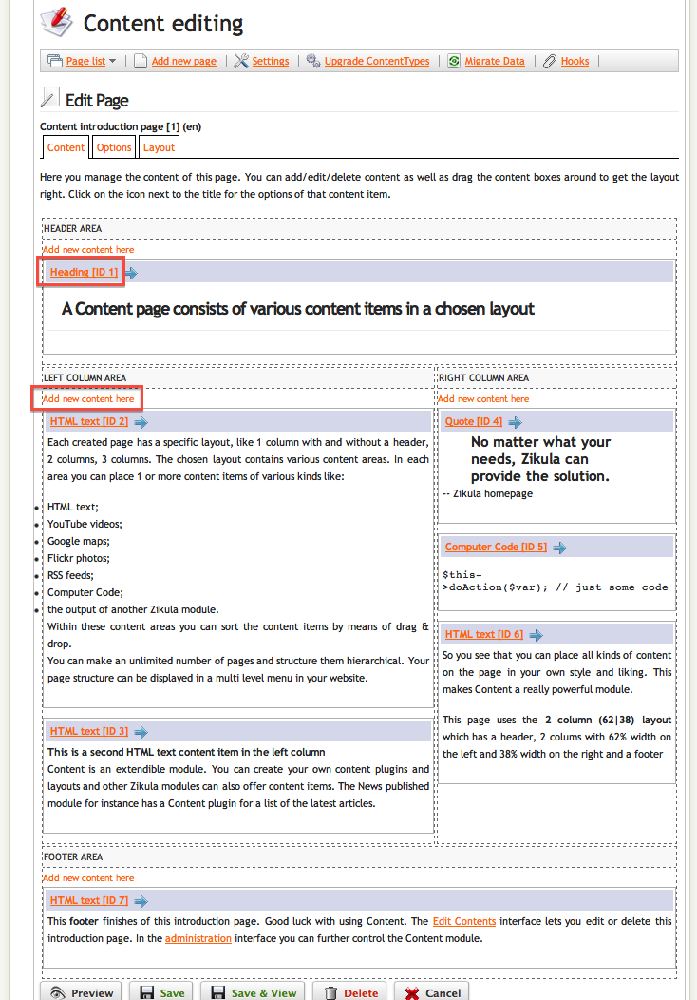

Setting Content
---------------

:Author:
    Timothy Paustian
    
Now that we have the appearance as we like, it's time to start adding content. To add content to Zikula, you need to install a module that will take the content in, store it in the database, and then display the content when asked. There are two very common forms of content that websites post, blogs and documentation. Blogs are time-sensitive information that reports what is going on right now. They can have a different focus depending upon your sites goals or your interests. For our gardening example, it could be tips and comments about the growing season. When to plant flowers, significant weather events, etc. Documentation is more permanent information that visitors may want to read at any time. For the Gardening site this could be comments on the best fertilizer, what kinds of flowers to plant in shady areas or ways to deal with rabbits. Zikula has different modules to handle these tasks.

Quick Guide
-----------
#. Download the News_, EZComments_, and Scribite_ modules and unzip. Drop the unpacked modules folders into Zikula/modules/.
#. In the Extentions module, install EZComments, Scribite and the News modules in that order.
#. Go to the admin interface for the News Module.
#. Click on the on the Hooks link at the top of the News module interface.
#. Drag Scribite hook from its location on the right, to the News Articles Hooks area. 
#. Do the same with the EZComments module, make sure it is above the Scribite module in the Hook List
#.  Navigate back to the News article list (click on News articles list on the left) then open the News introduction article for editing (Click on the red pen). You now have a WYSIWYG editing interface.
#. You can also see how EZComments affected your article. Go to the News Introduction Article and click on the eye to view it. At the bottom you will see a comment box. Type a comment and hit submit. Many content modules can have comments added to them.
#. Install the Content module
#. If you like, you can hook the EZComments module to the Contents module.
#. Click on Pages list. From here you will see a Content Introduction Page.
#. The Introductory page explains how to use the module
#. In the Admin Panel click on the Security Tab and then Click on Security center
#. Click on Allowed HTML settings.
#. A list of HTML tags will be shown. From here you can modify what tags those using forms on your site can use. When you have the settings as you like, click on Save

The Administration Interface
---------------------------

Before getting into setting up the News module, lets generally talk about the administration interface. Modules will usually have administration settings and you click on the Administration link to get to them. This is laid out in a tabbed interface. When modules are first installed they are placed in the uncategorized tab. (This is user configurable in the Administration Panel). To get to a modules Admin interface, just click on its image or name. Each module will have a menu of potential commands to choose from depending upon the module. 

The News Module
----------------

The News Module is the blogging application that is available for Zikula. Before we install the News Module, we are going to install two helper modules that enhance the capabilities of the News module. One is called EZComments that allows the ability to add comments to content from any other module. The other is Scribite. This adds WYSIWYG editing capabilities to forms. EZComments and Scribite are what are termed hookable modules. If the other module has been written in such a way that it can communicate with these modules, then they can hook into Scribite and EZComments and add their capabilities to the module.  

#. Download the News_, EZComments_, and Scribite_ modules and unzip. Drop the unpacked modules folders into Zikula/modules/. Make sure the names of the folders are News, EZComments and Scribite
#. Go to the admin page of your website. Click on the System tab, and then the Extensions Module. A list of all the available modules for you website will appear. 

    
    The Modules Panel showing the uninstalled News, EZComments, and Scribite modules. To install the modules, click on the little green (+) pages.

3. To install the modules, Click on the little green (+) page (highlighted in the red boxes). Install the EZComments and Scribite modules before the News Module. The EZComments module can work with the Akismet module to prevent spam comments. For a production site I recommend using this, but for now, we will skip it. Just click Accept when asked about the Akismet module while installing EZComments. 
#. The green (+) should go away and the module should change to active. First, check out the News module by clicking on it's link.
#. In the News module Admin Panel, there is already an initial demonstration article. Click on the view icon (the eye at the far right in the table) and it will open the article up. You can now read this article. Click on the Edit link to open up an editing form.

    
    The News Editing Form. Here is the interface for editing news articles. Note that we have not added Scribte module capabilities yet.

6. Writing content is simple, you have to just type in the text box. However it would be nice to have a more sophisticated editing form. This is what Scribite can give us, so lets hook that up now. Click on the on the Hooks link at the top of the News module interface.  On the right you will see modules that can hook to the News module. On the left you will see functions in the News module with which the hook modules can interact. Both the EZComments and the Scribite modules interact with the ui and do not filter the News text. Therefore, drag Scribite from its location on the right, to the News Articles Hooks area.

    
    Hooking Scribite to the News Module. This configures the Zikula software to notify Scribite whenever the editing interface for News is shown.

7. While we are here, also add the EZComments hook to the News Articles hook. Make sure that the EZComments hook is first in the list of hooks for the News articles.
#. Navigate back to the News article list (click on News articles list on the left) then open the News introduction article for editing (Click on the red pen). You now have a WYSIWYG editing interface! To be able to add fancy formatting to your text, you do need to change the page type from Plain text to Text formatted with mark-up language. There are all sorts of configuration options in the Scribite Module. I leave it to you to go check them out.
#. You can also see how EZComments affected your article. Go to the News Introduction Article and click on the eye to view it. At the bottom you will see a comment box. Type a comment and hit submit. Many content modules can have comments added to them.
#. At this point you might realize that this is ripe for spamming and abuse. EZComments has some good features to prevent spam and you can modify them in the Admin section of EZComments. To begin, lets make EZComments very restrictive, and you can later on decide to relax these restrictions. Go the the Uncategorised tab of the Administration menu and click on Comments
#. Click on Settings. Under Notification, check send mail on comment requiring notification.
#. Under Moderation, click on Enable Moderation and All comments require moderation. Click on submit. 
#. You have now set up your site so that every comment has to be viewed by you before it is allowed to be posted. This will prevent all spam, but requires work from you. 

Your News module is all set for posting items.

Content
-------

The Content module is made for creating more permanent and complex pages. It has very sophisticated tools for adding text, images, animations, maps, videos and more to your site. 

1. First, install the Content module by going to the Extensions Module and clicking on the Install icon as you did for the News module above.
#. If you like, you can hook the EZComments module to the Contents module.
#. Click on Pages list. From here you will see a Content Introduction Page.

    
    *The content introduction page.* 

4. The Introductory page explains how to use the module, so I will only point out a few things. While in the Content Tab, to edit any text, just click on its link. You will then be taken to a form where you can modify it. 
#. To create new content, click on the Add new content here links.
#. To change the layout, click on the Layout Tab. You can then choose from a whole host of layouts.
#. In the Options Tab you can set the Page Title, Description, Keywords and more.

Setting allowed HTML Tags
--------------------------

After you add content for a while, you may notice that some of the tags you try to use don't work. This is a security feature of Zikula, to help prevent hackers from messing with your site by trying to inject code through web forms into your database. The administrator is control of what HTML tags can be used in forms. These are set in the Security Center

1. Click on the Security Tab and then Click on Security center
#. Click on Allowed HTML settings.
#. A list of HTML tags will be shown. From here you can modify what tags those using forms on your site can use. When you have the settings as you like, click on Save.

Blocks
------

Blocks are the menus, polls and messages round the edge of the main content when you first view your site. There are many different blocks, and most modules have their own blocks provided in their distributions. There are three default block areas on most themes, left blocks, right blocks and center blocks. Whether all three of these areas are available on every page will depend on the theme's layout and templates. Certain themes may have additional block positions through the Xanthia theme engine provided in the distribution.

To administer blocks, and see the different types available to you, click the administration link in the main menu and then choose blocks. There are many different types of blocks, and each has a different use. As you install third party modules, more blocks will appear in this menu for you to use, if you wish.

.. _News: https://github.com/zikula-modules/News
.. _EZComments: https://github.com/zikula-modules/EZComments
.. _Scribite: https://github.com/zikula-modules/Scribite