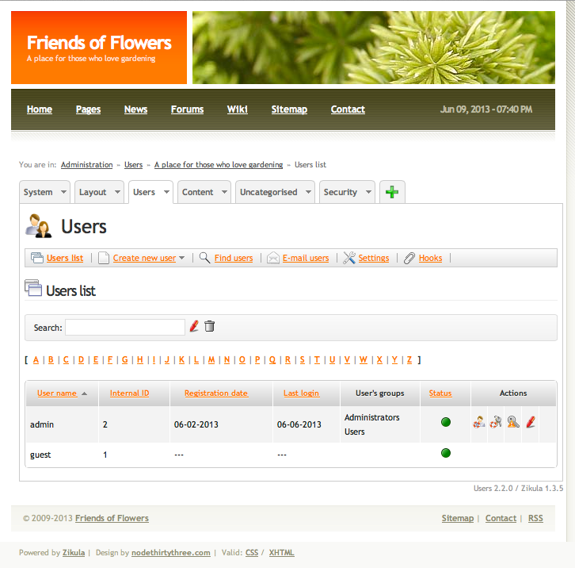
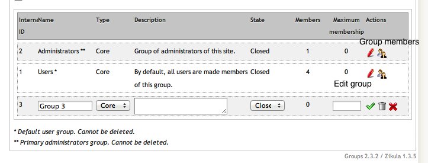
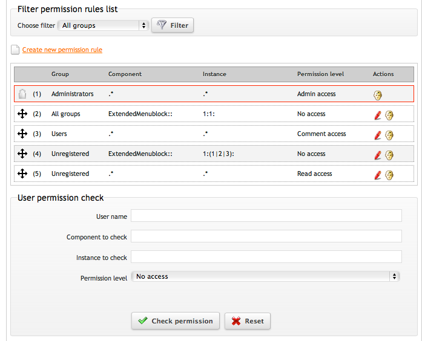
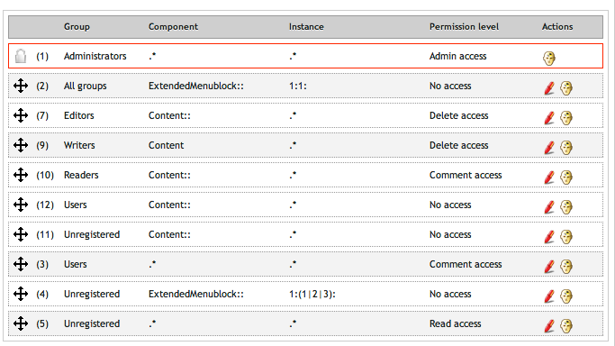

Users and Groups
----------------

:Author:
    Timothy Paustian
    
Quick Guide
-----------
Adding a user
+++++++++++++
#. Click on Create New User. In the new user panel you can set the username and Email address. 
#. For the log in information, you can either have Zikula Email the user and have them set up their password, or you can set it immediately. For this example, we will set it now. Click Yes in the Log in information area and type in a password. 
#. Click off acceptance of the Terms of Use, Privacy Policy and the Minimum Age requirement.
#. Click on check your entries and if everything checks out to Zikula's satisfaction, click Submit new user.

Adding a Group
++++++++++++++
1. Click on the Users tab and then on the Groups module
#. Click on Create new group. A new group should appear, yet be open to editing. 
#. Name the group. Select whether the group is Core, Public or Private.
#. Give the group a description and select Open or Closed for its state. Open groups allow registered users to add themselves. Close groups are only modified by those with admin access.
#. Set the maxiumu membership, 0 meaning unlimited membership.

Setting Permissions
+++++++++++++++++++
1. Click on the Users tab and then on the Permissions module.
#. Click on Create new permission rule. A rule will be created at the bottom of the table. In the Group section, pick the group the rule affects.
#. For the Component type what modules are affected. 
#. Choose what instance of the module is affected by this rule. Leaving the instance as .* makes it apply to all instances. 
#. Set the access rule to the level of permission that you want this rule to apply. 
#. Save the rule by clicking on the green checkmark. 
#. Finally, move this rule to a placed in the permission table where it will have its desired affect. Rules are read from top to bottom. See the below description for more details.

Levels of use of your Zikula Site
---------------------------------

Users are a way to identify a specific individual who comes to your site and then adapt the site accordingly. Comments they make or articles that might be posted to the site are attributed to them. If you have a forum install, such as Dizkus, they can post under their user name. Groups are a way of putting together communities of users, and controlling access to certain parts of the site. For example, maybe you want to have staff that are working on your Friends of Flowers site to be able to post articles. You do not want to add them to the Administrators since that will allow them access to modifying your whole site. Instead, you can place them all in a separate group and then set the permissions such that only they can post new content. (More about permissions in a minute)

When you first install a Zikula site there are two groups already made for you, Users and Administrators. You cannot delete these groups because they are essential for running the system. You can create other groups and add users to them.

When a visitor comes to your site, they are treated as Unregistered and this can be thought of as a third group of users of your site. They will have access to all public areas of the site. If they sign up for an account or you create one for them, they are added to the Users group automatically and have access to any part of the site that is open to registered users. The best way to learn about how this works is to do things with them. Lets start with an example.  Imagine that you have 3 staff you want to add, Sally, Robert and Matt. They will have access to Content module and be able to write articles. We also want Sally to be able to admin the Content module. Finally we have a Readers group that has access to specific content. 

Adding Users
------------

#. Users are administered through the Users module. Go to your administration area, click on the Users tab and then on the Users module. You should be presented with the main admin view. 

    
    The Users admin main view

2. Your initial site will only have one user, the account you set up when you first started. To add an account, you will need a username and an Email address for each user you want to add. 
#. To begin the process, click on Create New User. In the new user panel you can set the username and Email address. 
#. For the log in information, you can either have Zikula Email the user and have them set up their password, or you can set it immediately. For this example, we will set it now. Click Yes in the Log in information area and type in a password. 
#. Click off acceptance of the Terms of Use, Privacy Policy and the Minimum Age requirement. Your finished registration setup should look like the below figure.

.. figure:: CreateNewUser.png
    :alt: The finished new user dialog for Sally
    
    Setup of the New User panel for registration of Sally as part of the site.

6. Click on check your entries and if everything checks out to Zikula's satisfaction, click Submit new user.
#. Your new user should be created and appear in the list of users. Create two more users, Robert (robert22, robert22@friendsoffloswers.com) and Matt (matt21, matt21@friendsoffloswers.com). When you are all done, your users panel should look like this.
 
 .. figure:: UsersAdded.png
    :alt: Your finished group of users after following the steps listed.
    
    Your finished group of users after following the steps listed.
    
8. Now we need to set up our groups. Click on the Users tab and then on the Groups module. Two default groups are listed, Administrators, with one member, and Users, with 5 members. Click on the little group icon at the far right for the Users group.
#. First we want to remove guest from the Users group. We do not want guests being able to access places where registered users can go. To do this, click on the big red minus sign at the far right.
#. Next, click on group list to get back to the main view and then on Create new group. A new group should appear, yet be open to editing. Name this group Editors. Leave its type as Core and give a description to the group. Keep the state as closed. If a group is closed, only the admin can add Users to the group. If it is open, users can add themselves to the group. Leave the maximum membership at 0, meaning there is no limit. Click on the green checkmark to save.

    
    The create group panel. Note the purpose of the icons. The bottom group (Group3) is ready for editing.
    
11. In a similar fashion create a Writers, and Readers group.
#. Now click on group membership for the Editors. Click on the asterisk below Add users to group. Select sally23 and Click on Add.
#. In the group list, click on group membership for the Writers group. Click on the asterisk and then shift click on all matt21, robert22 and sally23, then click add. 
#. We have our users set up in groups. Our last step is to set permissions. Click on the Users tab and then on the Permission module. 

The permissions module is one of the most powerful modules for Zikula, giving you fine grain control of how your site behaves. With power comes complexity and it can take a while before a new admin understands how to set permission rules. Before we get into administering permissions, lets take a little detour to explain how this works.

Each module, if programmed to Zikula standards, will check with the permission module whether a given command sent by a user is allowed. Each module has its own permission scheme and this should be describe in the module documentation. If there is not documentation for the module explaining permissions, you can often open up the Versions file and workout how to set up your permissions.

The permission rules are applied to each function call into Zikula. The call will query the permissions module for the specific user asking for access. Zikula then consults the permissions table, starting with the first rule, and looking for a match to the Component and Instance. These matches are done using regular expressions, which are an incredibly powerful pattern matching method. For more information consult this Regular Expressions tutorial_. RegEx is well worth learning. A few examples will help you to understand how permissions work. First, here is the Permissions table.

    
    The Permissions table. The rules are applied from top to bottom. When a match is found, Permissions stops and returns true, allowing access to the tested module.

Imagine that you are part of the admin for the site, and you are trying to access the main Administration page. The Administration module would then ask Permissions to see if it should grant you access. It looks at the first rule and sees that you are in the Administrators group. So it then checks what to Components (what modules and plugins) you should have access. Here we find (.*). The period says match any character, and the asterisk says match 0 or more time.s So this expression is basically saying, match all Components. It then checks what instances, and again, you should have access to all instances. So the rule succeeds, and you are allowed access. When a permission rule succeeds, Permissions returns true and stops checking the table. In other words, the order of the rules is important. 

Imagine a second rule where you are an unregistered user and you are trying to access the Administration pages. The Administration module would again ask Permissions to see if you had access. No group would match until the 4th rule, but the Component would now fail, because the module asking is the Administration module, not the Menu module. The 5th rule would have a matching group, component and instance, but you are only granted Read access. You need Admin access to be granted access to the administration modules. This check would then fail and access to these pages would be denied.

Setting permissions correctly can be tricky. It takes an understanding of regular expressions, understanding the security schema of the module in question, and an understanding of permissions. Be patient and experiment.

There is no documentation of the rules schema for Content, but if you open up the Versions.php file for Content located at Content/lib/Content/Version.php, the first part of Security schema says ('Content::' => '::'). What this means is to grant acces to the entire module just list Content:: as your component and open it up for all instances. This is just what we want to do. We also want to block access to content unless you are registered at the site. So we want to make another rule that blocks all Content. 

1. Click on Create new permission rule. A rule will be created at the bottom of the table. In the Group section, choose Editors. For the Component type **Content::**. Leave the instance as **.\***. Set the access rule to Admin access and then save the rule by clicking on the green checkmark. In English this rule says, "If the person is in the Editors group and is asking for permission to access the Content module with the ability to edit, create, delete and admin articles, grant it to them."
#. We now need to move this rule up, because if we left it where it is, Rule number 3 would come back as true and restrict the Editors to comment access. (Remember that all users are in the Users group.) So we have to move it above that rule. Click on the rule, drag it, and drop it above the Users rule.
#. A really cool feature of Zikula is you can then test these rules. Under User permission check, type sally23 as the user, and type Content::. You can type anything you want in the instance box, as we granted delete access to anything. Set permission access to Delete access and then click Check permission. Access should be granted. Test changing the user or raising the access to admin access and you should see the rule fails.
#. Now set up the Writers group permissions. Click Create new permission rule. Set the items as follows: Group - Writers; Component - Content::; Instance - .*; Permission level - delete access. In English this rule says, "If the person is in the Writers group and is asking for permission to access the Content module with the ability to edit, create, and delete articles, grant it to them."
#. Move this rule just below the Editors rule for Content. (Why would you not want it about this rule? Think about Sally's permissions.) Then test it out for Robert, Sally and Matt. Does it work as expected?
#. Finally lets create three more rules. That only allow individuals in the Readers group to access content. Your final table looks like the figure below.

    
    The finished permissions table. This allows Sally to admin the Content module, Matt and Robert to create, edit and delete articles, users in the Readers group to read articles, and prevents Unregistered users from reading articles. 

You now have a finished permissions table for controlling content. Go ahead and explore these rules.

.. _tutorial: http://www.regular-expressions.info/tutorialcnt.html