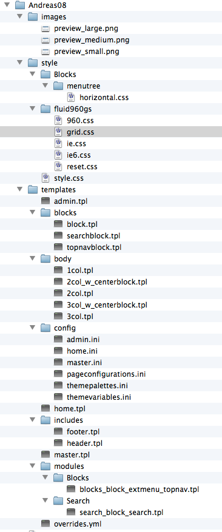
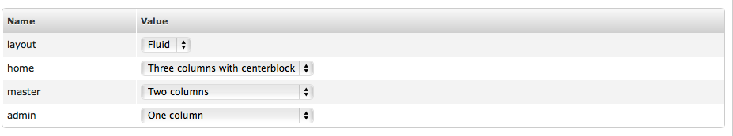

An example theme
================

:Author:
    Timothy Paustian
    
To help you to understand how all these parts work together, lets disect an working theme that comes with Zikula, Andreas08. This theme was created to demonstrate how to implement many of the properties of themes. Here is the folder organization of the Andreas08 Theme

    
    The organization of files and folders for the Andreas08 Theme

images
======

The images folder for Andreas08 only contains previews for how the site will look when configured with this theme. These will show when an admin mouses over the name of the theme in the theme admin panel.

style
=====

The style folder contains all the css files for the theme. For this theme there are a large number of css files because the theme has many options that the admin can choose from. This tutorial will not explain css styling of web pages, and it is expected the reader is familiar with this.

templates
=========
Most of the important layout of the theme occurs in the templates folder. The first file to look at is the pageconfigurations.ini file at templates/confing/pageconfigurations.ini. This lists descriptions of the ini files for the various page layout options. 

::

    [master]
    file = master.ini
    
    [*admin]
    file = admin.ini
    
    [*home]
    file = home.ini
    
For a theme there are three major templates that can be implemented, a home page template (used for the home page), an admin template (used for any administration pages) and a master template (used for all other pages). Initilization for the page takes place in the ini file for each. Here is the master.ini file.

::

    page = master.tpl
    palette = palette1
    
    [blocktypes]
    
    [blockpositions]
    left = blocks/block.tpl
    right = blocks/block.tpl
    center = blocks/block.tpl
    topnav = blocks/topnavblock.tpl
    search = blocks/searchblock.tpl
    
    [blockinstances]

The page variable indicates the template to render from, the pallette variable describes the color scheme of the template (again we are going to ignore this as it should really be described in the css files). Blockpositions lists the templates that are to be used for the various types of blocks that may be part of the layout of the template. Both blocktypes and blockinstances are rarely used.

Lets examine the companion master.tpl that is reference in the master.ini file. Here is the code....

::

        {include file='includes/header.tpl'}
    

        {blockposition name=topnav assign=topnavblock}
        {if empty($topnavblock)}
        <ul class="z-floatleft">
            <li><a href="{homepage}" title="{gt text="Go to the site's home page"}">{gt text='Home'}</a></li>
            <li><a href="{modurl modname='Users' type='user' func='main'}" title="{gt text='Go to your account panel'}">{gt text="My Account"}</a></li>
            <li><a href="{modurl modname='Search' type='user' func='main'}" title="{gt text='Search this site'}">{gt text="Site search"}</a></li>
        </ul>
        {else}
        {$topnavblock}
        {/if}
        {blockposition name=search}
    

    {include file="body/$master.tpl"}
    {include file='includes/footer.tpl'}

Note that currently Zikula templates uses smarty syntax for the templating. The template first includes a includes/header.tpl. As these templates are rendered, any included files are added and rendered, passing along all the template variables that are available. Here is the file header.tpl...

::
    <!DOCTYPE html PUBLIC "-//W3C//DTD XHTML 1.1//EN" "http://www.w3.org/TR/xhtml11/DTD/xhtml11.dtd">
<html xmlns="http://www.w3.org/1999/xhtml" xml:lang="{lang}" dir="{langdirection}">
        <head>
            <meta http-equiv="Content-Type" content="text/html; charset={charset}" />
            <title>{pagegetvar name='title'}</title>
            <meta name="description" content="{$metatags.description}" />
            <meta name="keywords" content="{$metatags.keywords}" />
            <meta http-equiv="X-UA-Compatible" content="chrome=1" />
            {pageaddvar name="stylesheet" value="$stylepath/fluid960gs/reset.css"}
            {pageaddvar name="stylesheet" value="$stylepath/fluid960gs/$layout.css"}
            {pageaddvar name="stylesheet" value="$stylepath/style.css"}
            {browserhack condition="if IE 6" assign="ieconditional"}<link rel="stylesheet" type="text/css" href="{$stylepath}/fluid960gs/ie6.css" media="screen" />{/browserhack}
            {pageaddvar name='header' value=$ieconditional}
            {browserhack condition="if IE 7" assign="ieconditional"}<link rel="stylesheet" type="text/css" href="{$stylepath}/fluid960gs/ie.css" media="screen" />{/browserhack}
            {pageaddvar name='header' value=$ieconditional}
        </head>
        <body>
    
            

                

                    <h1 class="title"><a href="{homepage}">{$modvars.ZConfig.sitename}</a></h1>
                    <h2 class="slogan">{$modvars.ZConfig.slogan}</h2>
                

The header contains the top part of the page and this is consistent for all the templates of this theme, so they were placed into a single file. 

Continuing on with the master.tpl file, After the header, there is standard smarty calls and html code for the template. Note how the block positions are spelled out in the tempalte (i.e. {blockposition name=search} ). This tell Zikula where to put this block in the code when it is rendered. Another feature of these templates, is the ability to use theme variables within the code. In the lines 

::
    {pageaddvar name="stylesheet" value="$stylepath/fluid960gs/$layout.css"}
    
    and 
    
    {include file="body/$master.tpl"}
    
The css style sheet used in the header depends upon the value of $layout and the template included for the body depends upon the value of $master. Both of these are set by the admin of the site. More about this in a second. Finally the template is completed by the addition of the footer template...

::

                

                    
{gt text="Powered by"} <a href="http://zikula.org">Zikula</a>{if $modvars.Theme.enable_mobile_theme} | <a href="{modurl modname='Theme' type='User' func='enableMobileTheme'}">{gt text="Mobile version"}</a>{/if}

                    {nocache}{pagerendertime}{/nocache}
                

            

    </body>
</html>

Together they make up the complete master template. The home.ini and admin.ini files have complementary home.tpl and admin.tpl that lay out the code in a similar manner. Spend some time going through these files to make sure you understand how they work.

Themevariables
==============

The themevariables.ini file lists the variables that are available to the admin of the site to change. Here is the file.

::

    [variables]
    layout       = grid
    home         = 3col_w_centerblock
    master       = 2col
    admin        = 1col
    
    [layout]
    type   = select
    values = grid,960
    output = Fluid,Fixed
    
    [home]
    type   = select
    values = 1col,2col,2col_w_centerblock,3col,3col_w_centerblock
    output = One column,Two columns,Two columns with centerblock,Three columns,Three columns with centerblock
    
    [master]
    type   = select
    values = 1col,2col,2col_w_centerblock,3col,3col_w_centerblock
    output = One column,Two columns,Two columns with centerblock,Three columns,Three columns with centerblock
    
    [admin]
    type   = select
    values = 1col,2col,2col_w_centerblock,3col,3col_w_centerblock
    output = One column,Two columns,Two columns with centerblock,Three columns,Three columns with centerblock

At the top of the file, [variables] list the variables that are available and their default values. The rest of the file defines the admin interface for changing these variables. To see what this file does, go to your site and pull up the theme admin interface. Make Andreas08 the site theme. Now click on the edit icon (it looks like a page with a pencil) for Andreas08. Then click on the Variables tab. You will see the following

    
    The theme variables interface.
    
As you can see, the admin interface for the variables was rendered from themevariables.ini. If you change any of these variables in the admin interface, it will change what happens while rendering the code. For example, change the admin menu from 1 col to 2 cols and hit save. You will see the left column appear. Experiment with the other variables and see what happens to the theme. As you can see it is possible to design powerful, flexible themes in Zikula, much more than in any other cms this author has used. 

It is possible to add variables to a theme, change page configurations and color palettes from inside the theme admin interface, but I think it is wiser to add changes to the theme files directly. 

The layout menu controls what css files are included. Go back and look at the header file for the master.tpl. You will see the layout variable picks a different style sheet. Either 960.css or grid.css. If you look at the two style sheets, 960.css defines all the parameters in percentages, while the grid.css defines them all in exact pixels.

Ideas From espaan
The rest is good to explain, so layout separated from content, including js/css, caching, Adapting an existing theme, converting an ready made HTML theme (e.g. open source template) into a Zikula Theme. Menus.