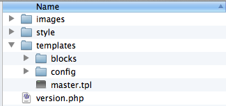

Adapting an Open Source Theme
=============================

:Author:
    Timothy Paustian

Finding a Theme
===============

You may not find a design that you like in the Zikula community. From here you can roll your own, or you can adapt from other web design efforts. There are literally thousands of open source web designs available for you to adapt and many of these can be found at Open Source Themes_. Browse through their amazing collection and find one that appeals to you. Then download the theme. If you look inside, you will typcially find a various folders. These can be organized in many ways and the trick to adapting them to Zikula is bending the design so Zikula can read it. 

Adpating CrystalX
=================

For this example, we will manipulate the CrystalX_ theme. Download the theme, unzip it and examine the folder structure. You will see that it has a css folder and a design folder. We can map the css folder to the style folder in our Zikula theme. The design folder is loaded with images, so that will become our image folder. The index file contains both the design and the text, so we will adpat this to our template. Drop this folder into your Zikula Themes directory and we will begin modifiying it. 

Create Zikula Theme Structure
=============================

First create the appropriate folder structure. Rename the css folder to style, and the design folder to images. Create a templates folder and move the index.html file inside. Rename index.html to master.tpl. Inside the templates folcer, create blocks and config folders. Copy the master.ini and pageconifiguration.ini from Andreas08 and place them in the conifig folder. Also copy over block.tpl, topnavblock.tpl and searchblock.tpl from Andreas08 to the blocks folder. Finally copy a version.php file from Andreas08 to your CrystalX folder. When finished, your directory should look like this.

    
    Folder stucture of the theme once everything has been renamed.

version.php
===========

We first need to provide information about the theme to Zikula. This is information that Zikula displays to administrators and provides information about how the theme can be used. Change the code in the version.php file to match the following.

::

    $themeversion['name'] = 'CrystalX';
    $themeversion['displayname'] = __('CrystalX');
    $themeversion['description'] = __("Based upon the open source theme by vit.dlouhy (http://www.oswd.org/user/profile/id/19895).");
    $themeversion['version'] = '1.0';
    $themeversion['admin'] = 1;
    $themeversion['user'] = 1;
    $themeversion['system'] = 0;
    $themeversion['license'] = 'GPL';
    $themeversion['xhtml'] = true;

Once you have changed all this information, save the version.php file.

Create the config files
=======================
You need to define the page templates to the theme. All themes require a master.tpl file and we will define only that one. In the pageconfigurations.ini file, place the following. 

::

    [master]
    file = master.ini

This is the bare minimum and many more configuration files can be made, with home.ini and admin.ini files being the most common.

The master.ini file describes to Zikula where to find the template files it will need for building template pages. The following goes into the master.ini file.

::
    
    page = master.tpl

    [blocktypes]
    
    [blockpositions]
    right = blocks/block.tpl
    center = blocks/block.tpl
    topnav = blocks/topnavblock.tpl
    search = blocks/searchblock.tpl
    
    [blockinstances]

These are the templates Zikula uses to layout the html code of the site. Most of the action takes place in the master template.

Editing the master template
===========================

The most difficult job of getting a Open Them to work is converting the index.html file to a template that Zikula will work with effectively. An effective way to do this is to use an existing, working Zikula theme, and using it as a guide as you create your new theme. 

First, open up the master.tpl you just created. You will see areas labeled as header, main and footer. We will follow along with that design and split them into a few templates, just in case we want to add custom main areas later on. Cut everything before the &lt;body&gt; tag and paste it into a new document that you save at includes/header.tpl.

Now in the main template file, add the following at the top.

::
    {include file='includes/header.tpl'}
    
This will add everything in the header.tpl file into the master.tpl. We really don't need to do that here, but just in case in the future you wanted to create more templates, the header code could be reused. Create a new file and place it into a newly created folder called includes. The path to this file should be CrystalX/templates/includes/header.tpl. Paste the code into the file. Some editing needed to be done to adapt it  to Zikula. It should look like this when done.

::
    <?xml version="1.0"?>
    <!DOCTYPE html PUBLIC "-//W3C//DTD XHTML 1.0 Strict//EN" "http://www.w3.org/TR/xhtml1/DTD/xhtml1-strict.dtd">
    <html xmlns="http://www.w3.org/1999/xhtml" xml:lang="cs" lang="cs">
    <head>
        <meta http-equiv="content-type" content="text/html; charset={charset}" />
        <meta name="author" content="All: ... [Nazev webu - www.url.cz]; e-mail: info@url.cz" />
        <meta name="copyright" content="Design/Code: Vit Dlouhy [Nuvio - www.nuvio.cz]; e-mail: vit.dlouhy@nuvio.cz" />
        
        <title>{pagegetvar name='title'}</title>
        <meta name="description" content="{$metatags.description}" />
        <meta name="keywords" content="{$metatags.keywords}" />
        
        <link rel="index" href="./" title="Home" />
        <link rel="stylesheet" media="screen,projection" type="text/css" href="{$stylepath}/main.css" />
        <link rel="stylesheet" media="print" type="text/css" href="{$stylepath}/print.css" />
        <link rel="stylesheet" media="aural" type="text/css" href="{$stylepath}/aural.css" />
    </head>
    
Much of the code inside the master template file is actually filler code that can be removed. Below is the stripped down version of the master.tpl after removing all the filler code.

::
    {include file='includes/header.tpl'}

    <body id="www-url-cz">
    <!-- Main -->
    

    
        <!-- Page (2 columns) -->
        

        

    
            <!-- Content -->
            

                   {$maincontent}
            
 <!-- /content -->
    
            <!-- Right column -->
            

                

    
                   {blockposition name=left}
                   {blockposition name=right}
                
                
 <!-- /col-in -->
            
 <!-- /col -->
    
        
 <!-- /page-in -->
        
 <!-- /page -->
    {include file='includes/footer.tpl'}

Note how this code is very clean and it is obvious where the main and module content goes. Note that this is a 2 column layout so both the right and left layouts go into the Right column.

Finally transfer the code at the bottom into the footer.tpl and place it in the same folder as the header.tpl

::
         <!-- Footer -->
        

            
created by <a href="http://www.nuvio.cz">Nuvio | Webdesign</a> <!-- DON´T REMOVE, PLEASE! -->

            
&copy; 2007 <a href="mailto:my@mail.com">My Name</a>

        
 <!-- /footer -->
    
    
 <!-- /main -->
    
    </body>
    </html>

Now try out your new theme by going to the layout tab and choosing your theme in the themes module. Once finished, Zikula should load the content into your theme. You will see a number of display glitches and these can be fixed by editing the css file that comes with the theme (main.css). Most of all the widths of the template have to be expanded. Editing the css file is not really in the scope of working with Zikula. With a little tweaking and work, we can have a working CrystalX layout that works within Zikula.
.. _Themes: http://www.oswd.or
.. _CrystalX: http://www.oswd.org/design/preview/id/3465