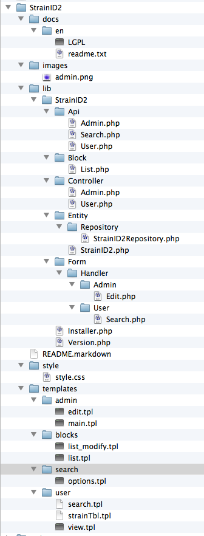

.. _Model-View-Controller: http://php-html.net/tutorials/model-view-controller-in-php/
.. _Content: 2_3_content.rst
.. _Doctrine: http://docs.doctrine-project.org/en/latest/tutorials/in-ten-quick-steps.html
======================
Basic Module Structure
======================

:Author:
    Timothy Paustian

The Zikula core system expects modules to be organized in a specific fashion. This allows the system to make assumptions about where to find certain routines and create opportunities for all sorts of powerful interaction between your module, the system and other modules. A folder, entitled with the name of the module, forms the root of the organization. The entire organization of all the files and folders is shown below

    
    The arrangement of folders and files in a Zikula module. Do not be intimidated by the large number of files and folders. We will go through the purpose of all of them.

Inside this root folder, are the following folders

- docs
- images
- lib
- style
- templates

docs
----

The docs folder is for any documentation that your write about your module. Here you should explain any important installation instructions and then how users are to interact with your module. Module authors are encouraged to write good documentation. The better your docs are, the easier it is to user you module and the more individuals may find it useful. 

Inside the docs folder will be folders representing each language that documentation is written in: en (English), german, danish, france, dutch, etc. Each folder will hold a translation of the documentation. You obviously are not responsible for writing translations into other languages, but if your module becomes popular, others may want to add a translation to it.

images
------

The images folders contains any module specific images you use in your code. At a minimum it will hold a admin.png image that is displayed in the extensions module in the administration panel of Zikula. You are welcome to place any other custom images you use in your user interface to your module. Be aware of the large collection of stock images that come with Zikula. Often you can find an image there, and not have to clutter you module with images.

lib
----

The lib folder is where you place all the php code that makes your module work. You will spend most of your time inside this folder, pulling your hair out wondering why your &U%^(# code isn't working. And then you will find that typo and it will all work. This folder must contain at least one subfolder entitled with the name of your module. It may also contain other supporting code from vendors that is outside of your modules functionality. That type of code is outside the scope of this tutorial. Zikula is organizes its module code in a Model-View-Controller_ format. To reflect this, the folders inside the lib/ModuleName folder will be organizes in such a way to encourage you to use this popular programming paradigm. The Model in Zikula is represented by the Api and Entity folders, the View by the Block, Form, and other folders and the Controller by the Controller folder. Inside the lib/ModuleName folder you will find the following folders.

Api
---

The Api folder contains code that manipulates the Model of your modules. This is where codes that updates/changes the data model and provides access to the data should go. Normally you will have get and set functions here that access the entityManager. More information on this below.

Block
------

If your module will provide display blocks that can become part of the page layout of your site, then you will write the code that creates them here. See Content_ in the User Manual for more information about blocks.

Controller
----------

The Controller folder contains the code that responds to user interaction with your module. Here is where you respond to user clicks on your module and then perform some action with the data model or the view. This is split into two files, one for Admin and one for User interaction.

Entity
------

The Entity folder is the second half of the model part of your module. It contains the code that interfaces with your persistent data stored in the database. New Zikula modules should use Doctrine_ to map php objects that represent the module data in the code to database tables. This is actually pretty simple once you understand how this all works and will be demonstrated in the example module we create later.

Form
----

This folder contains any forms that need to be created to accept user input. Once data is entered and the user hits send, the Controller classes collect the data and send it on to the Entity for storage in the database of for grabbing data from the database.

Installer.php
-------------

This class controls the installation and removal of your module from a Zikula site. It installs database tables, subscribes or publishes any services that the module offers to other modules and adds any default data to the module. Code for upgrading from one version of the module to the next is also provided.

Version.php
-----------

This class lists the Version of the module and how its permission scheme works. This information helps administrators and the system with the upgrade process and interacting with the permission scheme.

style
------

The style folder contains any css styles for your site. It is added to any page that you generate to you module automatically and is available in your templates to help in formatting the user interface.

templates
---------

The templates folder contains all templates that are used for formatting your html code for the interface that the user or admin of your module sees. These templates are called by your controller class to render you html.

As we go through this tutorial, building a simple module, we will demonstrate the use of each of these folders.