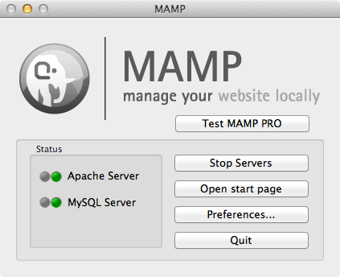
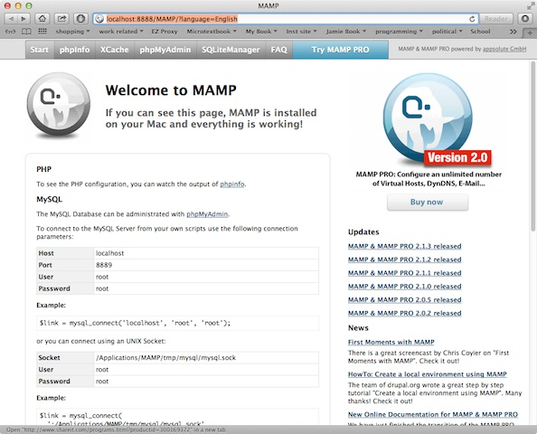
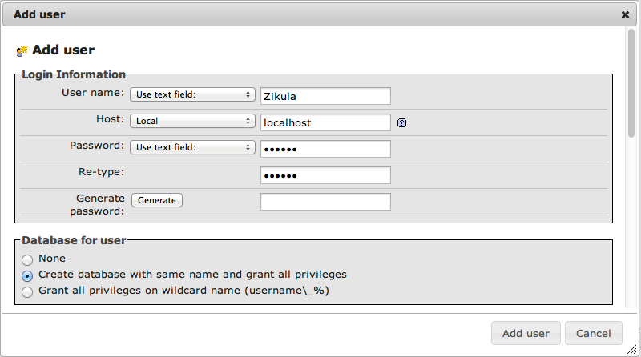

Installing Zikula
=================
:Author:
    Timothy Paustian
    
Testing out Zikula on your Desktop Computer
--------------------------------------------

System Requirements
-------------------

Zikula requires PHP 5.3.2 or greater and that `date.timezone` be set in the 
php.ini configuration file. This will normally be taken care of by your hosting environment, but we will demonstrate how to modify this variable in different hosting environments. The minimum MySQL version is 5.1 and it is not recommended to install Zikula with MySQL STRICT mode enabled. During the configuration of Zikula we will go through not to make sure the STRICT mode for MySQL is turned. off. Finally, Zikula requires Apache 2.0 or higher to run well. Make sure any hosting environment that you choose has installed these versions of the packages or greater.

Background Technology of Serving Web Pages
------------------------------------------

Lets take a little time and explain all this technology . If you already know what php, Apache and MySQL are, then please skip this section.

Apache is the heart and soul of your web site. At the basic level, it takes requests from the internet and finds the information that is requested in the server directory structure and sends that back to the asking application. The server sends back information most often in the form of a web page, full of html markup, to the requesting application, typically a web browser, and that is then presented to the user. How this web page is built can happen in a large number of ways. 

In the early days of the world wide web, requests asked for files located in directories inside the serving folder. These static pages were actually files with html markup inside them. As the web became more sophisticated, web sites wanted to have a consistent identity and look to them. Each page was laid out with similar html markup, lets call it a template, so that users could have access to important parts of the site, such as the home page, forums, etc. A big disadvantage to using static pages to create these sites was that the template had to go into each page, wasting disk space. Further, if anything in the template needed to change, all of the static pages would need to be updated.

Many solutions to this problem were created. One package that has become a popular solution was to combine the use of a programming language, php, with a database, MySQL. This technique now goes by the name AMP (Apache, MySQL, Php). Instead of requesting static html pages, users were guided to requesting little php programs, that then built the pages and returned an html document. During this building process, the php program made requests to the MySQL database for various pieces, instead of going to the file system. This was much faster, as database programs are optimized for rapid access. Since this page was being built dynamically from parts, the template only had to be created once and each page could refer to it. 
Using php allowed modification of the page when it was served to the user, not just when it was created or modified. This capability has many uses, for example, adjusting the page if it is to be seen on a mobile device, or preventing ads from showing if a user is a subscriber to your site.

Over the years developers have created sets of php scripts and programs that handle the basics of serving pages. Many of these have matured into frameworks that can take care of the details of serving dynamic pages with php. Zikula is one of these solutions.

In the next section we will take a test drive of installing a web server on your local computer, and then getting Zikula up and running.

Get MAMP or WAMP
----------------

When you first start to play with a technology that you are unfamiliar with, it is often useful to set up a test environment on your own computer, so that you can play and not have to worry about the entire internet seeing what you are doing. This is a very common desire by many web developers. In the past, the process of getting AMP running on your machine was arduous, time-consuming, and fraught with little pitfalls. Lucky for you the good folks at AppSolute created MAMP (Mac, Apache, MySQL, and php) and WAMP (Windows, Apache, MySQL, and php). These are open source, free projects, hosted at source forge. They provide you with everything you need to get a server up and running on your local machine. The process is very simple, just follow along with these steps.

#. Go get MAMP_ or WAMP_ and download the software to your machine. 
#. Once the software is downloaded, unzip it and move it to the /Applications folder (mac). The windows installer will put things in their proper place.
#. Your web server files will be stored in a special directory, called the Server Root directory. For MAMP the path is /Applications/MAMP/htdocs. For WAMP the path is c:\wamp\www. For the rest of this section, I will point describe the directions for MAMP. The directions for WAMP are identical and I am getting tired of typing MAMP or WAMP.
#. Start MAMP. A window should come up showing you the server is starting. When it is finished, it should look like this.

    
    When MAMP launches, a status window appears showing you that the program is active and allowing you to turn apache and mysql on and off as needed.

#. Make sure that the Status of both the Apache server and MySQL is green.
#. Click on the Open Start Page button.
#. If all is well, a web browser should open and you should see the MAMP start page.

    
    If you see this start page, then your set up is working. Note that the URL uses a different port (8888) than Apache normally does (80). This is to prevent you having to ask admin permission for MAMP every time you open it.
#. Lets create a php file and make sure that our own code will work with this server. 
#. Navigate to your Server Root directory and create a file with this php code::
    <?php
        print "<h2>Hello World!</h2>\n";
        print "
This is my first attempt at a PHP web page.
\n"
    ?>

#. Save the file in your Server Root directory, naming it test.php
#. Now point your browser at this address. http://http://localhost:8888/test.php. If all is well you should see your web page in all its glory. You have now demonstrated that MAMP is running on your local machine. Let's now install Zikula.
#. Download _Zikula  (You will need toclick on the Get Zikula button located in the upper left corner.)
#. Unzip the contents and rename the folder Zikula. 
#. Drop the folder into your Server Root directory (htdocs)
#. You will need to set permissions in one folder in the Zikula Directory. Open your Zikula folder and click on the ztemp folder. Choose Get Info. From there go to the sharing and permissions section and make sure that everyone can read and write to this folder. Click on the little gear and choose *Apply to enclosed items* This will allow Zikula to write needed files into this directory.
#. Go back to the MAMP start page. While in MAMP, click on the Open Start Page button. You will notice a tab title phpMyAdmin. This is a set of php pages that help you to create and manage MySQL databases using an easy to navigate interface.
#. While in phpMyAdmin, we need to create a database in MySQL for Zikula to use and also create a database user that the Zikula code will use to access the database. We can do these tasks in one command.
#. While in the phpmyadmin page, click on the *Users* tab (upper left of the page). While in the Users tab, find the *Add user* link near the bottom of the page and click on it. Fill out the dialog as shown here.

    
    In this dialog create a user. Be sure to write down the username and password you set up here, you will need them during the installation of Zikula. Also make sure you click the create *Create database with same name and grant all privileges* 
    

#. Now navigate to http://localhost:8888/Zikula/install.php and follow the directions for the install. Once the installation process is complete, you can visit your Zikula website by navigating to index.php, http://localhost:8888/Zikula/
    
Finding a Hosting Environment for Zikula
-----------------------------------------

#. System Requirements for Zikula
#. php
#. mysql
#. Apache
#. Disk space required
#. Bandwidth
#. Moving files into your directory
#. FTP programs
#. File Managers that come with sites
#. Creating mysql databases similar to what we did with MAMP, most hosting environments have phpmyadmin abilities

.. _MAMP: http://www.mamp.info
.. _WAMP: http://www.wampserver.com
.. _Zikula: http://zikula.org 